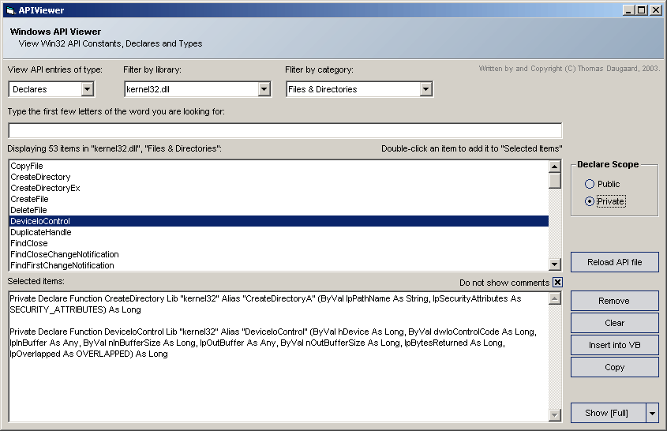



## Replacement API Viewer

### Description

An API viewer to replace Visual Studio's 'apiload.exe'.

Includes list filters (Function/Sub Categories (Partially done), Filter by Library (e.g. kernel32.dll, gui32.dll etc.).

Update: Working on getting the "Insert into VB" function to work. Also, changed project to ActiveX EXE so it can be a VB Add-In.
 
### More Info
 

             |
---                |---
**Submitted On**   |2003-06-01 12:10:54
**By**             |[Thomas Daugaard](https://github.com/Planet-Source-Code/PSCIndex/blob/master/ByAuthor/thomas-daugaard.md)
**Level**          |Intermediate
**User Rating**    |5.0 (30 globes from 6 users)
**Compatibility**  |VB 6\.0
**Category**       |[Complete Applications](https://github.com/Planet-Source-Code/PSCIndex/blob/master/ByCategory/complete-applications__1-27.md)
**World**          |[Visual Basic](https://github.com/Planet-Source-Code/PSCIndex/blob/master/ByWorld/visual-basic.md)
**Archive File**   |[Replacemen159492612003\.zip](https://github.com/Planet-Source-Code/thomas-daugaard-replacement-api-viewer__1-45872/archive/master.zip)

